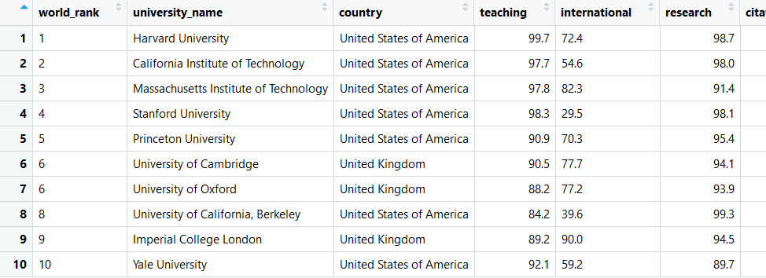
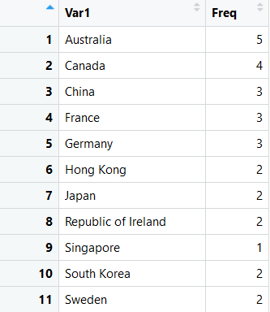
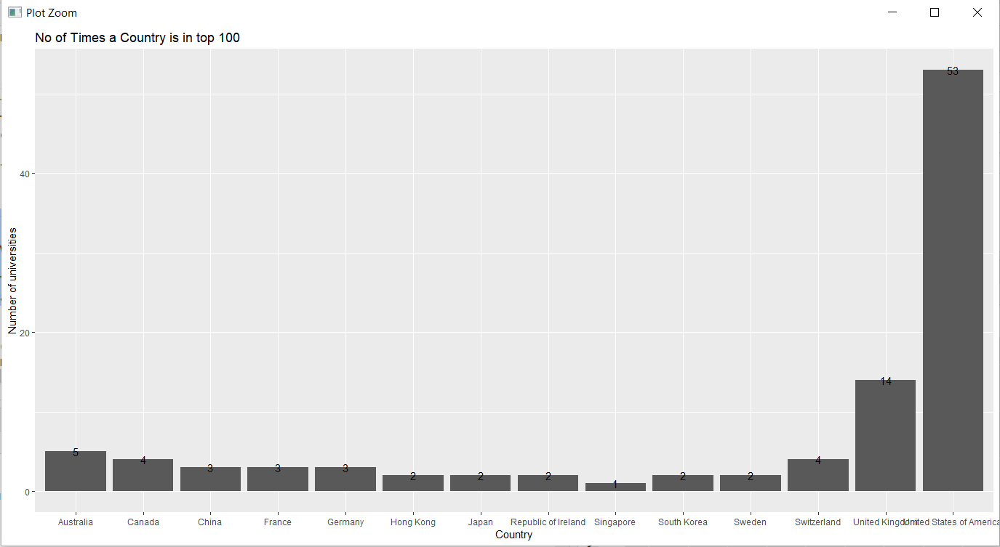
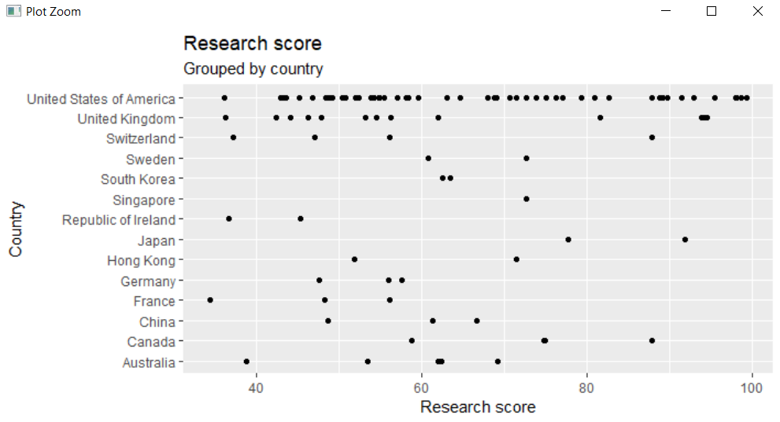
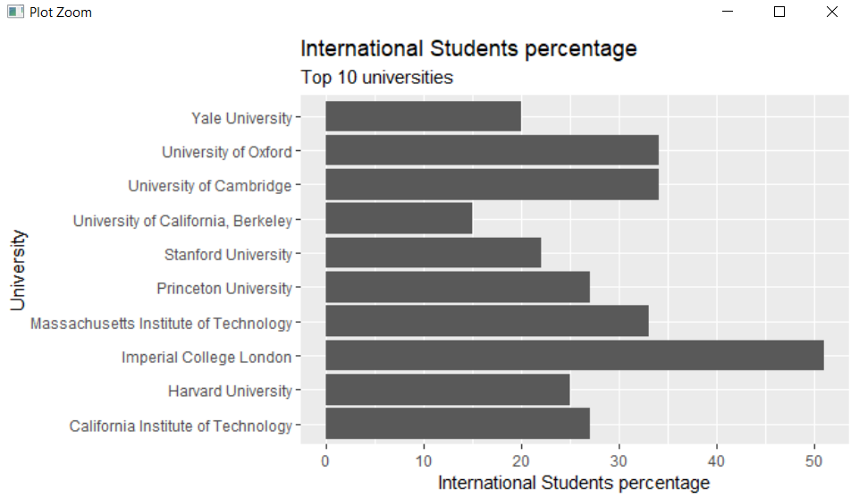
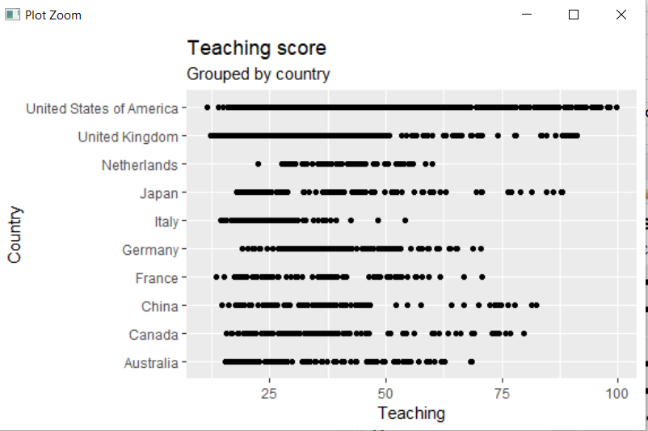
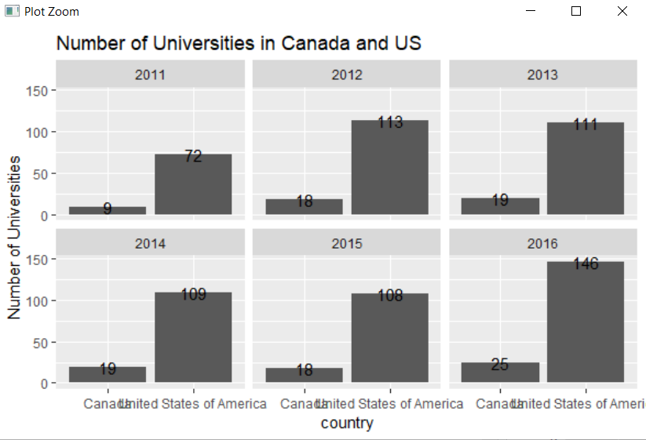
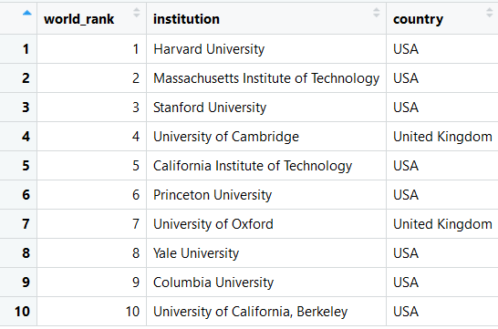
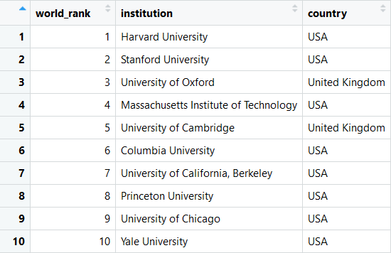
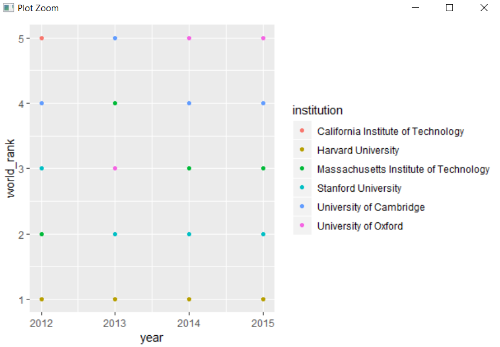

# University-Ranking-Using-R
Ranking University using multiple R librabies and plotting them

# <h1> 1) Top 10 Universities in 2011

  
# <h1> 2) Countrywise distribution of top 100 Universities

  
# <h3> No of Times in TOP 10

  
# <h1> 3) Top 10 University Depending on no of International students in 2011

  
# <h1> 4) Top 10 University Depending on no of International students in 2011

  
# <h1> 5) Teaching Score Grouped by Country

# <h1> 6) Number of Universities in Canada and US

# <h1> 7) Top 10 university of world in 2012

  
# <h3> Top 10 university of world in 2013

# <h1> 8) Top 5 University from 2012-2015

